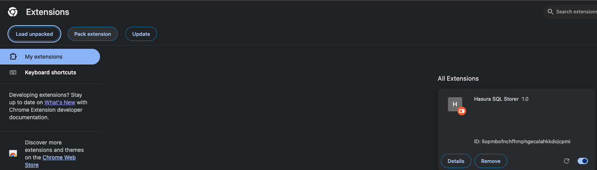
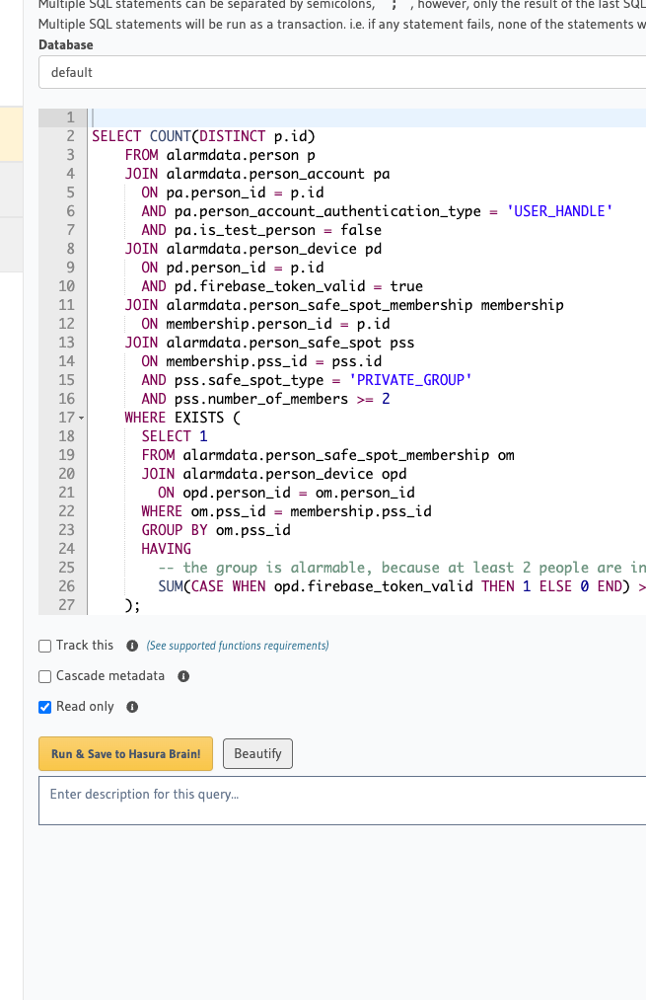
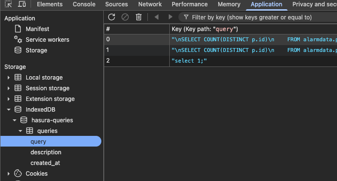

## Running This Extension

1. Clone this repository.
2. In the browser open chrome://extensions/ 
3. "Load unpacked" and select the cloned repository folder.
4. Click the extension icon in the Chrome toolbar, then select the "Hello Extensions" extension. A popup will appear displaying the text "Hello Extensions".
5. Your  https://cloud.hasura.io/project/8c99370c-8b61-43be-b9a1-fcdfaac9d108/console/data/sql should look like this now

6. Queries will be saved in "Chrome Dev Tools (F12)" > Application > IndexedDB > hasura-queries
7. 
